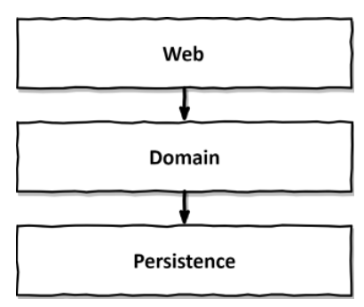
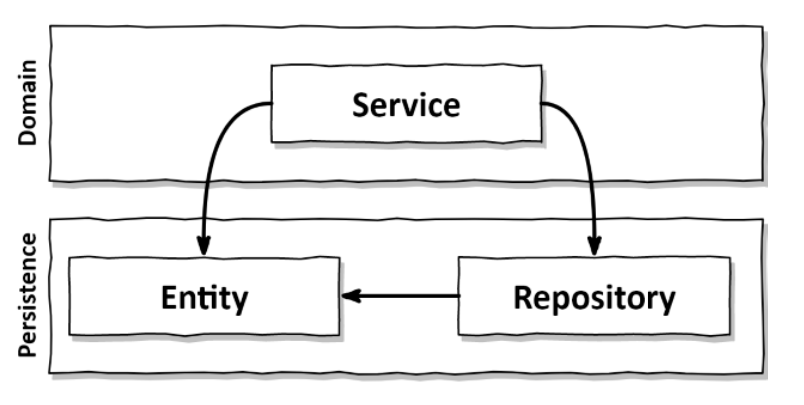
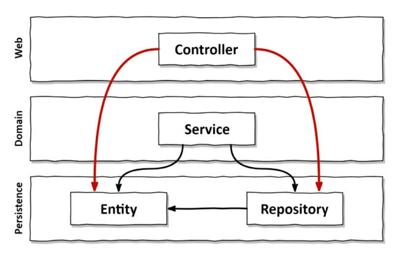
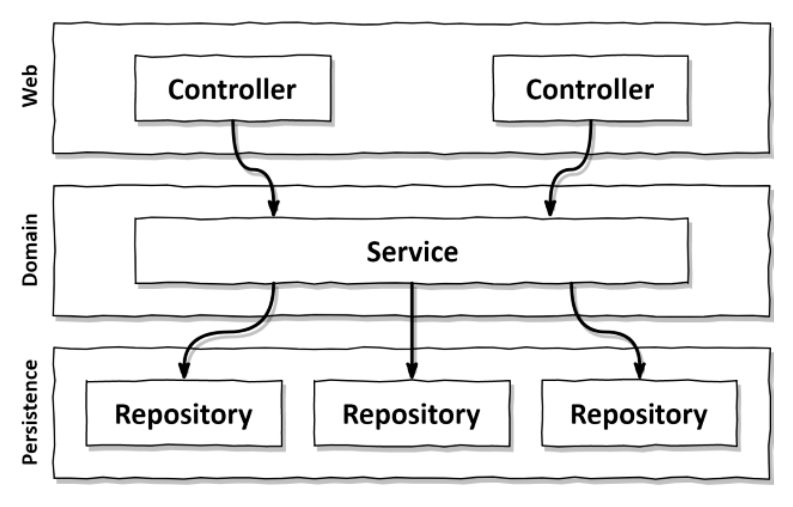

# 1. What’s Wrong With Layers?

Three layer architecture.
Web layer that receives requests and routes them to a service in the domain layer. The service calls components from the persistence layer to query for or modify the current state of our domain entities.  

## It Promotes Database-Driven Design

The foundation of layered architecture is the database.  

> We're trying to create a model of the rules or 'polices' that govern the buiness in order to make it easier for the users to interact with them. So why are we making the database the foundation of our architecture and not the domain logic?  

If we combine an ORM framework with a layered architecture, we’re easily tempted to mix **business** rules with **persistence** aspects.  

  

Our services use the persistence model as their business model and not only have to deal with the domain logic.  

## It’s Prone to Shortcuts  

> In a conventional layered architecture, the only global rule is that from a certain layer, we can only access components in the same layer or a layer below.  

Break this rule once may be OK. But doing it once opens the door for doing it a second time. And if someone else was allowed to do it, so am I, right? This is a psychological effect called the “Broken Windows Theory”.  

## It Grows Hard to Test  

A common evolution within a layered architecture is that layers are being skipped. We access the persistence layer directly from the web layer, since we’re only manipulating a single field of an entity and for that we need not bother the domain layer, right?  

  

It has two drawbacks if it happens often.
- we’re implementing domain logic in the web layer.
- In the tests of our web layer, we not only have to mock away the domain layer, but also the persistence layer.  

## It Hides the Use Cases  

Since we’re so often searching for the right place to add or change functionality, our architecture should help us to quickly navigate the codebase. How is a layered architecture holding up in this regard?  

A layered architecture does not impose rules on the “width” of domain services. Over time, this often leads to very broad services that serve multiple use cases.  

  

A broad service not only makes the service hard to test, but also makes it hard for us to find the service responsible for the use case we want to work on.  

How much easier would it be if we had highly-specialized narrow domain services that each serve a single use case? Instead of searching for the user registration use case in the ***UserService***, we would just open up the ***RegisterUserService*** and start working.  

## It Makes Parallel Work Difficult ⬅️  

> Adding manpower to a late software project makes it later.  

Imagine we’re adding a new use case to our application. We have three developers available. 
- One can add the needed features to the web layer. 
- One to the domain layer.
- The third to the persistence layer, right?  

It usually doesn’t work that way in a layered architecture. Since everything builds on top of the persistence layer, the persistence layer must be developed first. Then comes the domain layer and finally the web layer. So only one developer can work on the feature at the same time!