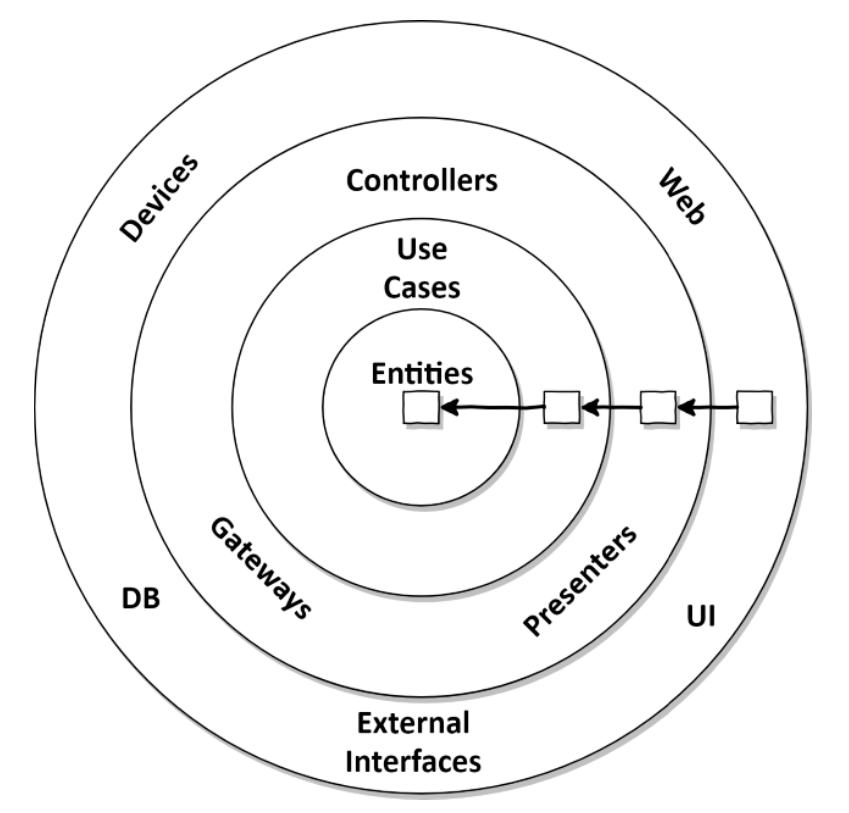

# 2. Inverting Dependencies

## The Single Responsibility Principle  

A common interpretation of this principle is this:
> A component should do only one thing, and do it right.  

Here’s the actual definition of the SRP:
> A component should have only one reason to change.  

As we see, “responsibility” should actually be translated to “reason to change” instead of “do only one thing”. Perhaps we should rename the SRP to “Single Reason to Change Principle”.  

If a component has only one reason to change, we don’t have to worry about this component at all
if we change the software for any other reason, because we know that it will still work as expected.  

Sadly, it’s very easy for a reason to change to propagate through code via the dependencies of a
component to other components.  

  

The only reason to change component E is when the functionality of E must change due to some new requirement. Component A, however, possibly might have to change when any of the other components change, because it depends on them.  

## The Dependency Inversion Principle  

In contrast to the SRP, the Dependency Inversion Principle (DIP) means what the name suggests:  

> We can turn around (invert) the direction of any dependency within our codebase.  

## Clean Architecture  ⬅️

The layers in this architecture are wrapped around each other in concentric circles. The main rule in such an architecture is the Dependency Rule, which states that all dependencies between those layers must point inward.

  

The core of the architecture contains the domain entities which are accessed by the surrounding use cases. The use cases are what we have called services earlier, but are more fine-grained to have a single responsibility (i.e. a single reason to change), thus avoiding the problem of broad services we have discussed earlier.  

Around this core we can find all the other components of our application that support the business rules. This support can mean providing persistence or providing a user interface, for example. Also, the outer layers may provide adapters to any other third-party component.  

Since the domain code knows nothing about which persistence or UI framework is used, it cannot contain any code specific to those frameworks and will concentrate on the business rules. 

Clean Architecture comes at a cost, we have to maintain a model of our application’s entities in each of the layers.

## Hexagonal Architecture (⚠️ improve this part, summary is 💩)

  

Within the hexagon, we find our domain entities and the use cases that work with them and the hexagon has ***no outgoing dependencies.***  

### Ports  

A port is an interface between the system and the outside world that has been designed for a particular purpose or protocol.

> protocol: a set of rules or procedures for transmitting data between electronic devices.  

Ports are not only used to allow outside clients to access the system but also to allow the system to access external systems.  

A port is a technology agnostic API that has been designed for a particular type of interaction with the application (hence the word "protocol"). Here are a few examples:
- A port used by your application to access a database.
- A port used by your application to send out messages such as e-mails or text messages.
- A port used by human users to access your application.
- A port used by other systems to access your application.
- A port used by a particular user group to access your application.
- A port exposing a particular use case.
- A port designed for polling clients.
- A port designed for subscribing clients.
- A port designed for synchronous communication.
- A port designed for asynchronous communication.
- A port designed for a particular type of device.

### Adapters

Ports are technology agnostic, but you still need to interact with the system through some technology. This is where ***Adapters*** come in.

An adapter allows interaction through a particular port, using a particular technology. For example:
- A REST adapter allows REST clients to interact with the system through some port.
- A RabbitMQ adpter allows RabbitMQ clients to interact with the system through some port.
- An SQL adapter allows the system to interact with a database through some port.
- A Vaadin adapter allows human users to interact with the system through some port

Outside of the hexagon, we find various adapters that interact with the application. There might be a web adapter that interacts with a web browser, so on an so forth.  

Adapters can be of two types:
- Inbound Adapters (drive/ left): Used when the ***Core Application*** are called by external resources.
- Outbount Adapters (driven/ right): Used when the ***Core Application*** needs access to external resources.

|          Left Adapters         	|              Right Adapters             	|
|:------------------------------:	|:---------------------------------------:	|
| They call our application core 	| They are called by our application core 	|  

