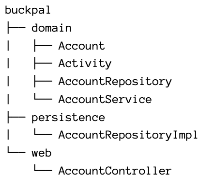

# 3. Organizing Code

## Organizing By Layer

  

Three reasons why this package structure is suboptimal.

1. We have no package boundary. If we add a feature for managing users, we'll add at least more one class in each layer. This might quickly become a mess of classes leading to unwanted side effects between supposedly unrelated features of the application.
2. We can’t see which use cases our application provides. What use cases the AccountService or AccountController classes implement? If we’re looking for a certain feature, we have to guess which service implements it and then search for the responsible method within that service.
3. We can’t see our target architecture within the package structure.  

## Organizing By Feature

  

All the code related to accounts is on the high-level package account. We have also removed the layer packages.  

We can enforce package boundaries between the features by using package-private visibility for the classes that should not be accessed from the outside.  

Renamed AccountService to SendMoneyService, we can now see that the code implements the use case “Send Money” just by looking at the class names. It is what Robert Martin calls a “Screaming Architecture”, because it
screams its intention at us.  

We have no package names to identify our adapters, and we still don’t see the incoming and outgoing ports.